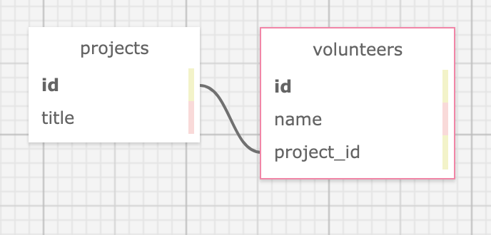

# _Volunteer Tracker_

#### Created By _**Christopher Neal**_

#### _An application to track volunteers on a project_

## Technologies Used

* _Ruby_
* _Gems_
* _Bundler_
* _RSpec_
* _IRB_
* _Pry_
* _Sinatra_
* _Capybara_
* _Postgres_
* _SQL_
* _SQL Designer_

## Description

_This project was created for Epicodus bootcamp to show proficiency in  using a SQL database and routing in Ruby using Sinatra. The user can add volunteer projects and their volunteers to the site._

## Database Schema

## Setup/Installation Requirements

* Clone the GitHub [repository](https://github.com/christophermneal/volunteer_tracker) or download and open the Zip on your local machine.
* From the main project directory, enter `bundle install` in the terminal to populate gems.
* To create a database, type in your terminal:  
      `createdb volunteer_tracker`  
      `psql volunteer_tracker < database_backup.sql`  
      `createdb -T volunteer_tracker volunteer_tracker_test`
* After building the database, enter `rspec` into the terminal to confirm passing of all tests.
* Enter `ruby app.rb` to run the program with Sinatra.
* Open browswer and enter the url "http://localhost:4567/" unless otherwise prompted in the terminal.

## Known Bugs

_None at this time_

## License

_[MIT](https://opensource.org/licenses/MIT)_
Copyright (c) _26 December 2021_ _Christopher Neal_

## Support and Contact Details
_[christopher.m.neal@gmail.com](mailto:christopher.m.neal@gmail.com)_
